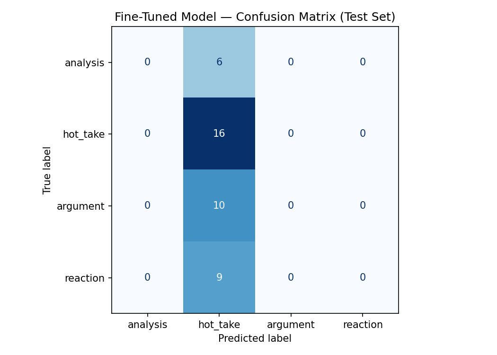

# TakeMeter

> A fine-tuned text classifier for evaluating discourse quality in Reddit's r/soccer community.

***

## Project Overview

TakeMeter is a fine-tuned text classifier designed to categorize comments from Reddit's r/soccer community into discourse quality categories. The r/soccer subreddit provides a diverse, large-scale dataset of comments across match threads and debate posts, enabling the classification of discourse into four distinct types: Hot Takes, Reactions, Arguments, and Analyses. This tool helps surface high-quality discussions and identify low-quality contributions in one of Reddit's most active sports communities.

***


## Demo
[](https://videotourl.com/videos/1781992876326-b1808acb-0b2a-4a45-b1dd-fe4543886ae6.mp4)


## Label Taxonomy

| Label | Definition | Examples |
|-------|------------|----------|
| **Hot Take** | A novel claim with the potential to spark debate but with little to no perceived backing of evidence, data, or logical reasoning. | 1. "Ronaldo is too old to win the World Cup with Portugal."<br>2. "Lamine Yamal will be our next generations GOAT, comparable to Ronaldo and Messi." |
| **Analysis** | An objective description of events, statistics, or situations supported by observation, evidence, and fact without taking sides. | 1. "Messi was able to score a hattrick against Algeria, ending the game with a score of 3-0."<br>2. "Japan was able to tie against The Netherlands with a score of 2-2 as Kamada scores the final goal of the match in the 89th minute." |
| **Argument** | A subjective claim supported with concrete evidence, data, or logical reasoning, following the structure: Claim + Evidence + Conclusion. | 1. "Lamine Yamal will be our next generations GOAT because of his trajectory. At 18 years and 7 months, Lamine Yamal has accumulated 100 combined goals and assists..."<br>2. "Messi is the undisputed GOAT of football because of many factors. He holds La Liga's all-time records for most goals (474), most goals in a single season (50), and most hat-tricks (36)..." |
| **Reaction** | A subjective expression of emotion, shock, or personal feeling regarding an event that does not make a universal claim or argument. | 1. "Messi just scored an insane banger of a goal."<br>2. "What did I just witness? 😭" |

***

## Dataset

**Source:** Reddit (r/soccer) via Pullpush.io

**Collection method:** Comments were collected using the following filters to ensure quality and relevance:
- **Time Range:** Posts from the last 5 years to ensure modern discourse content
- **Engagement Threshold:** Comments with a score ≥ 5 to filter out spam and low-effort noise
- **Content Type:** High-engagement threads (match threads, discussion posts, hot takes threads)
- **Length Filter:** Posts must be at least 20 words to ensure sufficient context
- **Exclusions:** Posts from banned users and posts marked as "NSFW"
- **Rate Limiting:** 1.5 seconds

**Target volume:** 271 comments

**Size:** 271 

**Labeling process:**

Posts were labeled using a **Hybrid LLM-Assisted Pre-Labeling with Human Verification** approach:

1. **Rubric Creation:** Specific criteria for discourse quality with explicit examples defined
2. **Pre-Labeling:** An LLM processed the dataset using a few-shot prompt containing:
   - The discourse quality rubric
   - 5 examples of posts with correct labels and reasoning
   - The target comment text
   - Output format: JSON with `text`, `label`, `reasoning`, and `initial_confidence_score`
3. **Human-in-the-Loop Verification:**
   - **Low Confidence (<0.85):** Automatically flagged for manual review
   - **High Confidence:** A random 15% sample manually audited
   - Systematic errors trigger prompt refinement cycles
4. **Final Dataset:** Corrected dataset used for fine-tuning

**Labeling approach:** Posts were pre-labeled using an LLM with the annotation rubric, then manually reviewed and corrected. All LLM-assisted labels are disclosed in the dataset metadata.

**Label distribution:**

Train: 189 examples

Validation: 40 examples

Test: 41 examples

| Label | Train | Validation | Test | Total |
| :--- | :---: | :---: | :---: | :---: |
| hot_take | 74 | — | 16 | 90 |
| argument | 46 | — | 10 | 56 |
| reaction | 41 | — | 9 | 50 |
| analysis | 28 | — | 6 | 34 |
| **Total** | **189** | **40** | **41** | **270** |

**The quantity of the validation distribution was not explicitly shown so the sections for the labels are blank** 

### Difficult Examples

**Example 1:**
> Lol you dont really know much about marketing right? Even if he is not getting money from you the fact thats you are desperately commenting all over this thread means you are telling reddit that this

Label assigned: `Analysis`
Difficulty: This user makes a sarcastic remark about a persons lack of knowledge in marketing. This can be read as both an analysis and a reaction but because the user's last sentence makes a claim on the person being desperate about something based on something about the spoken topic, this is labeled as an analysis.  

***

**Example 2:**
> Oh no, now they'll all vote Messi for the League Cup instead of Messi for the World Cup. It's ruined!

Label assigned: `Reaction`
Difficulty: This is another case of a sarcastic remark on the GOAT, Messi. This reads as a hot take since the person claims that a specific audiencce is gonna vote for Messi on one thing over the other without substantial evidence or logic. However, as per the last sentence, it ends with "It's ruined," which means the persons initial claim set up his expressed personal feeling for the current state of  that ballot. Thus, a reaction. 

***

**Example 3:**
> Hey guys, anyone know what was written on the Spanish goal scorer's shirt? Can't see it in the replays either

Label assigned: `Analysis`
Difficulty: This is another tricky example where the user isn't making some sort of claim, formal argument, or reaction. Yet, he's asking a question about someones shirt. You can argue that because the user saw the persons shirt and out of curiosity asked the community what his shirt says, this is a reaction. But the final sentence says that they can't "see it in the replays either," which implies an observation on what they're seeing. Thus, an analysis. 

***

## Label Boundary Resolution: Dominant Intent Heuristic

When comments exhibit mixed signals across multiple labels, the **Dominant Intent Heuristic** is applied: the comment's final conclusion determines the label assignment. For example, "Messi just scored an insane banger of a goal. This is why he's the GOAT" is classified as a **Hot Take** because the final sentence drives the primary intent.

**Tradeoffs of this approach:**
- Loss of nuance: Comments with balanced, dual-intent are forced into one category
- Ambiguity in sarcasm: Sarcasm can flip the dominant intent (e.g., "Messi scored a hattrick? Yeah right... He's the GOAT.")
- Simplified metrics: Accuracy may appear high due to learning common patterns, but subtle label confusions may occur

***

## Fine-Tuning Pipeline

**Base model:** distilbert-base-uncased

**Training platform:** Google Colab

**Key training decision:**
For training, the hyperparameters for this pipeline will be set to three epochs and a 2e-5 for the learning rate. With only about 300 samples, the dataset has limited diversity, so 3 epochs gives the model enough passes to converge on the task signal without repeatedly overwriting the generalizable representations BERT already learned during pretraining. A learning rate of 2e-5 ensures each parameter update is conservative, preserving those pre-trained weights while still steering the model toward the downstream task. Together, these settings guard against the two primary failure modes for small-dataset fine-tuning: overfitting from too many epochs and catastrophic forgetting from overly aggressive updates. If we decide to scale to a higher dataset, nudging the learning rate towards 3e-5 to 5e-5.
***

## Baseline Comparison

**Baseline approach:**
<!-- Describe the zero-shot or few-shot LLM baseline model, prompt, and evaluation methodology -->

The few-shot LLM base model works by designating it's role as a classifier for a soccer subreddit. Essentially, the model is prompted so that it understands the labels with a given definition and an example containing an input and an expected output for each. The evaluation methodology will anchor the judgement of the model by using it as a rubric to distinguish those labels. After judgement, it will then be expected to return just the label name and no explanation for it's output. 

**Prompt used:**
```
"""
You are classifying comments from a subreddit, r/soccer.
Assign each comment to exactly one of the following categories.

Label 1: hot_take - A hot take can be defined as a novel claim with the potential to spark debate, but has little to no perceived backing of evidence, data, or logical reasoning. This can come in the form of an overall statement about a footballer such as: "This player doesn't have what it takes to be a world-class player," and proceeds to not elaborate on why that person thinks so. More examples can be seen below:

**Example:**
input: "Ronaldo is too old to win the World Cup with Portugal."
output: hot_take

Label 2: analysis - An analysis can be defined as an objective description of events, statistics, or situations. This type of statement will often not take any sides, and will be supported from observation, evidence, and fact.

**Examples:**
input: "Japan was able to tie against The Netherlands with a score of 2-2 as Kamada scores the final goal of the match in the 89th minute."
output: analysis


Label 3: argument - An argument is a claim that has the subjectivity of a hot take that is supported with concrete evidence, data, or logical reasoning like an analysis.

**Example:**
input: "Messi is the undisputed GOAT of football because of many factors. He holds La Liga's all-time records for most goals (474), most goals in a single season (50), and most hat-tricks (36). He's an 8-time Ballon d'Or winner, with Ronaldo being second to him with 5. Despite the past counter-argument for his lack of international trophies, Messi dismantled it completely by winning the 2021 Copa América, the Finalissima, and the 2022 FIFA World Cup."
output: argument

Label 4: reaction - A reaction is a subjective expression of emotion, shock, or personal feeling regarding an event. It does not make a universal claim or argument.

**Example:**
input: "Messi just scored an insane banger of a goal."
output: reaction

Respond with ONLY the label name.
Do not explain your reasoning.

Valid labels:
hot_take
analysis
argument
reaction
"""
```
## Evaluation Report

**Performance comparison:**

| Metric | Fine-Tuned Model | Baseline |
|--------|-----------------|----------|
| Overall Accuracy | 0.39 | 0.44 |
| Macro F1 | 0.14 | 0.42 |
| Hot Take F1 | 0.56 | 0.43 |
| Analysis F1 | 0.00 | 0.33 |
| Argument F1 | 0.00 | 0.43 |
| Reaction F1 | 0.00 | 0.50 |


**RESULTS COMPARISON**

|Model| Accuracy |
|-----|----------|
|few-shot baseline (Groq) |0.439|
|Fine-tuned DistilBERT |0.390|


Fine-tuning regression: 0.049


***


### Confusion Matrix

   

### Wrong Prediction Analysis

--- #1 ---
Text:      Man City fans were by far the most critical over VAR for a good part of a year back in 2019.
 
 Liverpool and Arsenal fans are loudest right now because they are on the end of shite VAR decisions rece...

True:      argument

Predicted: hot_take  (confidence: 0.40)

    Analysis: The model actually predicted correctly that this indeed a hot-take. Despite the comment having a solid claim in the first sentence, it's scarce in evidence and in a good conclusion, which also makes another claim of a person living in a bubble which also has little relevance to the main claim and no evidence to support it. This is an example of a text that was pre-batched by an LLM with a high confidence rate of 88%, but was not one of the 15% manually audited.


--- #2 ---
Text:      Jackson's handball? That still had his arms on his chest.
 
 This one is just flailing out
True:      analysis

Predicted: hot_take  (confidence: 0.36)

    Analysis: This comment has a very tricky case. Because at first the person questions why a person got called out for a handball when he claims that his arms were on his chest. The LLM recorded hot_take for the reason that the last sentence did sound like a claim with no evidence or logic. But because there was external nuance, this was an analysis. (e.g the person made an observation watching the match and because of that observation refutes the calling out of the handball claim)

--- #3 ---
Text:      What a silly tackle, come on Rasmus you’re better than that...

True:      reaction

Predicted: hot_take  (confidence: 0.37)

    Analysis: This comment has the impression of a hot take because it calls a tackle silly and claims Rasmus could've done better. While this does sound like a hot take, the strength of that sounding like a hard claim is not as strong as it sounding like a reaction to how appalling the tackle was according to the person. This was another failure of the model not registering the nuance of this comment.

***

### Failure Pattern Reflection

**Model Collapse to Hot Take:** The fine-tuned model exhibits a pathological convergence toward a single label—systematically predicting `hot_take` across nearly all test instances while abandoning other categories entirely. This collapse stems from two intertwined failures: the training data's severe imbalance (hot_takes comprise ~39% of examples) and the model's consequent learning of a deceptive shortcut—predicting the plurality class yields approximately 50% accuracy, which the optimizer found easier than learning genuine linguistic distinctions.

**Root Cause: Data Imbalance and Label Boundary Erosion** The training set's distributional skew is quantifiable, but the qualitative problem runs deeper. The label definitions, though semantically clear, may lack sufficient linguistic distinctiveness for DistilBERT to reliably partition in practice. The LLM pre-labeling stage's high confidence scores (many >0.85) suggest internal coherence, but such confidence may reflect circular reasoning within a narrow definition space rather than genuine separability in Reddit discourse.

**Systematic Vulnerability to Implicit Nuance** Even with rebalanced data, the model would remain fragile when confronted with comments embedding implicit meaning—sarcasm, contextual football knowledge, and layered intent that demand deep semantic comprehension. Examples #2 and #3 demonstrate this vulnerability: their true labels hinge on reading between the lines, on recognizing that "What a silly tackle" expresses *emotion* rather than *judgment*. DistilBERT's modest representational capacity cannot reliably reconstruct such nuance from ~270 examples, regardless of hyperparameter tuning. 


***

## AI Usage and Spec Reflection

### AI Tool Usage

**Intended uses (from planning):**

1. **Label stress-testing:** Generate 5–10 posts at label boundaries; if the LLM cannot classify them cleanly, refine label definitions
2. **Annotation assistance:** Use LLM (Claude Sonnet) to pre-label batches, then manually verify and track AI-assisted labels for disclosure
3. **Failure analysis:** Provide wrong predictions to LLM to identify 3 recurring error patterns; verify patterns quantitatively and qualitatively before adding to evaluation report

**Oversight approach:** Thoroughly review LLM outputs using Role-Task-Format prompting to minimize errors; edit accordingly before finalizing.

**Instance 1:**
- Directed: I brainstormed a draft of a plan to implement the data fetching process for the LLM to review, rephrase, and provide clarifying questions to.   
- Output: Upon confirming the plan and making a mini-spec of the document to implement the data fetching. 
- Override/revision: However, I noticed that the initial strategy: fetching comments using the Reddit API via PRAW has recently gotten more complex and time-consuming. So, rather than using the initial strategy, which deviated from the initial planning spec, I landed with Pullpush.io, a third-party archival service that provides data on past Reddit data. 

**Instance 2:**
- Directed: I delegated a pre-batching stage for the LLM to handle. Further instructions used a similar prompt to the classified prompt used for the baseline LLM model, which defined it's role and defined the characteristics of each label. 
- Output: The LLM returned a CSV file with the given label for each comment, the reasoning for those labels, and an additional section, which was the initial_confident_score. This initial confident score would guide a later process in my "Hybrid LLM-Assisted Pre-Labeling with Human Verification." 
- Override/revision: After the LLM finished the pre-batching process, I would begin to audit comments that the LLM labeled with a confidence score below 0.85. In cases where issues like the context and nuance of a comment would pose trouble for an LLM to vividly distinguish, human verification would be necessary to fill in that gap. 

### Spec Reflection

**Where the spec guided the work:**
<!-- One substantive way the planning.md helped guide the actual implementation -->

The spec guided my implementation by systemically breaking down the key layers of implementation for my project and clarifying requirements upfront. Prioritizing the sketch of a plan before implementation helps in handling a delicate task such as fine-tuning a model. Additionally, the spec eliminated a great degree of vagueness at each layer. For example, in my Label Taxonomy section, jotting down what an "argument" or a "reaction" was gave me a clear understanding of my labels coupled with consideration of the edge cases where a comment would not fit in any of the labels very easily.   

**Where implementation diverged:**
<!-- One substantive way the implementation differed from the spec and why -->

Mentioned in the AI Tool Usage section, the initial plan was to fetch the r/soccer Subreddit data via PRAW. However, because the policy has gotten more stricter and it would take time for a request to use the Reddit API, a different source, the Pullpush.io API, which housed archives of past Reddit data, was used in lieu of the original data fetching source. Though the data retrieved was older, though not substantially older as the archives fetched were from August 2023 to December 2023, the recency of the data was not very significant so this approach was more viable and quicker for our case. 

***

## Repository Structure

```
takemeter/
├── confusion_matrix.png 
├── evaluation_results.json
├── planning.md
└── README.md
├── takemeter-balanced-original.csv

```

***

## Setup

```bash
# Clone
git clone https://github.com/[your-username]/ai201-project3-takemeter.git
cd ai201-project3-takemeter
```